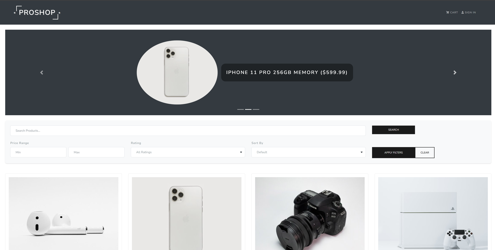

# ProShop eCommerce Platform

> Modern full-stack eCommerce platform built with MERN (MongoDB, Express, React, Node.js) stack & Redux



## Key Features

- 🛒 Full-featured shopping cart
- ⭐ Product reviews and ratings system
- 🎯 Featured products carousel
- 📱 Responsive pagination
- 🔍 Real-time search functionality
- 👤 User profiles with order history
- 🔐 JWT Authentication
- 💳 PayPal and credit card payment integration

### Admin Features

- 📊 Product management dashboard
- 👥 User management system
- 📦 Order tracking and management
- 📈 Sales analytics
- ✅ Order status updates

## Quick Start

### Prerequisites

- Node.js (v14+)
- MongoDB
- PayPal Business Account

### Environment Variables

Create a `.env` file in the root directory:

```env
NODE_ENV = development
PORT = 5000
MONGO_URI = your_mongodb_uri
JWT_SECRET = your_jwt_secret
PAYPAL_CLIENT_ID = your_paypal_client_id
```

### Installation

```bash
# Install server dependencies
npm install

# Install client dependencies
cd frontend
npm install
```

### Development

```bash
# Run frontend (port: 3000) & backend (port: 5000)
npm run dev

# Run backend only
npm run server

# Run frontend only
cd frontend
npm start
```

### Database Management

```bash
# Import sample data
npm run data:import

# Reset database
npm run data:destroy
```

### Production Build

```bash
# Create frontend production build
cd frontend
npm run build
```

## Demo login Credentials

```
Admin Access:
Email: admin@example.com
Password: 123456

Customer Access:
Email: john@example.com
Password: 123456
```

## Demo Paypal Credentials

```
Email: johndow123@personal.example.com
Password: JohnDow123@personal.

```

## Technologies Used

- Frontend: React, Redux, Bootstrap
- Backend: Node.js, Express
- Database: MongoDB
- Authentication: JWT
- Payments: PayPal API
